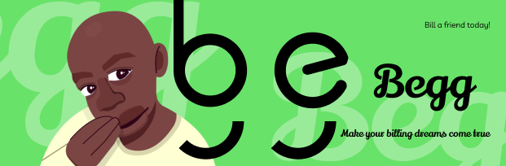

</img>
# Welcome to Begg

Begg is a proposed mobile application designed to facilitate peer-to-peer financial assistance among users, including loans specifically for students. By leveraging social connectivity and fostering a sense of mutual support, Begg aims to provide a platform where individuals can discreetly solicit and provide monetary assistance. We also would be extending to a global request feature and giveaway social network where people can give a beg-cap(Amount they need) and have people fund it. Do Beggquest(A giveaway action where people post money bugs and people can easily receive the money assigned for each person). This will increase usage of the app and allow user retention. Crowdfunding is the bigger picture I guess.

## Target Audience:

The target audience is composed of individuals primarily belonging to the following demographic groups:
Young adults (18-35 years of age)
College students
Millennials
Generation Z(Genz)

## Problem Identification:

Yeah, we all know begging is a thing, especially in our country Africa here😂🤦‍♀️. The need for an urgent 2k is always prevailing. In fact, if you are reading this. Just ask for my Beggtag(my account details). We need a platform that allows users to support each other with funds, loans, or even giveaways that can be won. Also, companies can give away to their customers using our app giveaway feature. I mean giveaway to people in our contact list is not easy at all. Imagine I want to give 50 people 5000 and make exceptions I need a way to do that. I think that’s where Begg comes in.

Many individuals face financial difficulties and often hesitate to seek assistance from friends or family due to embarrassment or social stigma. Begg addresses this challenge by offering a platform for anonymous financial requests, thereby alleviating the discomfort associated with direct solicitations.

## Proposed Solution
I know you must be asking yourself the difference between the proposed solutions and the features below(Oya you don catch me😂😝). The proposed solutions will be our key initiatives.

To address the problem above, Begg will provide a mobile application with the following features:
- Secure Platform: Begg will prioritize user privacy and security by implementing robust encryption and authentication measures.
- Anonymous Requests: Users can make financial requests anonymously, ensuring their privacy is protected.
= Real-Time Notifications: Users will receive real-time notifications for incoming requests, payments, and messages.
- Chat Functionality: Begg will incorporate a chat feature to facilitate direct user communication.
- User Profiles: Users can create profiles to manage their financial requests, payments, and preferences.
- Student Loans: Begg will offer a dedicated section where students can request and provide loans to other students, promoting a supportive community within the platform.
- Easy payment solution scan features that arise when you don’t have cash so you can gift people you don’t know. Traditional begging needs cash and easy gifting.

## Functions and Functionalities
### User Authentication:
- User registration and Login functionality.
- Integrations with Google, Twitter, and Facebook. etc
- Important information we would be needing from Email, Phone number, first name, last name, username, password, and date of birth.
- We would also have account tiers or levels like other fintech apps so we can allow users not up to 18(Genz) that have started making transactions beg from other people.
- We would also add provisions for user bio and user information as additional steps in the app so people can have begg profiles. We want to dominate others by prioritizing begg profiles. We can scan other begg profiles to know much about them.
- See his country and check if you can message him
- We may add verification for giveaways and rich funders. People must have given a certain amount to get the badge and their percentage must be great. This will encourage helping others. Nice market strategy if I must say.

### Profile Management:

- Customizable profile with personal and social details
- Display of Beggs and funds(which can be set to private🤣). I am thinking of adding that to premium features but I don’t want to add the premium business strategy. Maybe the only thing that will be premium will be your beggcard and beggtag.
- Display position in the fund and beg. Is this person a top beggar or a top funder? What is his rank on both sides? What is the ratio expressed as a percentage?
- Display the number of giveaways hosted and have followers count since it is a socially inclined app.
Begg Feed:
- You can see ongoing giveaways and global Beggs. You can fund Beggs. You also get to follow top funders and other people. Add them to your list which you can create in the app.
- Normal random posts and Begg story. Here they can add images and I am thinking of anonymous funding. Some people don’t want others to see them beg.
- Feature to exclude contacts or certain people in your network to see a particular Begg.
- Users can host giveaways(Beggquests) and set the visibility globally, contacts only, followers only.

### Decentralized Payment:

- I have given a hint earlier. We want to have a decentralized payment procedure that involves scanning and generation of codes. You are a beggar with a choice if you can specify the amount you need from someone and give dreamy eyes🤣🥺😅.
- To initiate payment you can ask for their beggtag(aza) which is like a virtual account number. Also, we have beggcodes(QR codes and normal unique numbers). Check the begging process for more on this.

### Loan feature:

- We need to add other providers and integrate them into our app. We are considering Easemoni and other platforms we can leverage for the loan feature till we get funding.

### Notifications:

- Real-time notification of a pending Begg, performance of giveaway amongst other transaction status details.

### Virtual cards:

- We will add a feature for a virtual begg card which allows people to use their virtual card in making transactions.

### Messaging feature:

- We are going to have a message feature that allows users to message each other.
- Users can send their beggcodes, videos, Images, and links to each other. 

## Begging Process

To initiate a begg process you can do it through different ways which are as follows:

You can send a beggtag(which will be your username) and you can send it to a user in the app and other mediums. Yes even physically😭😂.
You can send beggcodes(codes that expire in one hour for physical transactions and the code can even be sent online to other people in the app). This one is guaranteed because it escapes the bank for a moment until you want to redeem it and convert it to the main wallet.
Let me explain how the decentralized works under the hood. The decentralized system only works for beggcodes which can be in the form of QR codes too. When person A wants to beg from person B, Person A generates a beggcode specifying the amount only for a one-time transaction and the code expires in one hour. Person B enters beggcodes only too and it immediately generates the person A details like name and the amount he wants to beg for. Person B can then click the fund button and enter their PIN to confirm identity and voila the transaction is successful. Also, user A gets beggpoints equivalent to the money generated immediately.
In the process above, if the user decides to generate a code as a QR code to prevent anyone from funding without solicitation. What a decisive beggar😎😂🙌. The person who wants to fund can just scan the QR codes and it still brings the same information that codes bring. It's just a different data format.

Technical Specifications:
Development Framework: The application will be developed using React Native or Flutter known for its cross-platform compatibility.
Server-Side Architecture: The backend will be built using Node.js and Express.js for scalability and efficiency.
Database: MongoDB will be utilized for its document-oriented structure and flexibility.
Product design: The product UI will be shipped in Figma.

## App Navigation:

The proposed app navigation will consist of the following sections:
Home: This will serve as the main screen of the app, providing an overview of recent activities.
Requests: This section will display all financial requests made by the user, including loan requests.
Payments: This section will showcase all financial payments made by the user, including loan repayments.
Chat: This section will facilitate direct messaging between users.
Profile: This section will allow users to manage their profile information and preferences.

## Promotional Initiatives:

To encourage early adoption and generate user excitement, Begg will implement the following promotional initiatives:
Referral Program: Users who successfully refer friends to the platform will receive incentives.
Social Media Campaigns: Begg will leverage social media platforms to raise awareness and attract potential users.
Influencer Partnerships: Collaborations with influential individuals will be pursued to expand Begg's reach.

